[🇬🇧 English](README.md) · 🇩🇪 Deutsch

# Fleuron

Ein kostenloser, plattformübergreifender Kalender mit To-Do- und Einkaufslisten-Funktion für Familien, Vereine und kleine Teams – basierend auf deinem eigenen CalDAV-Server. Kein Cloud-Zwang, kein Abo, kein proprietäres Backend nötig.

---

## Warum es diese App gibt

Meine Frau und ich haben nach einer Möglichkeit gesucht, Termine mit unterschiedlichen Teilnehmern zu planen. FamilyWall schien die naheliegende Wahl zu sein, aber die kostenlose Version ist ziemlich eingeschränkt, und für Premium wollten wir nicht zahlen – vor allem nicht für einen Dienst, bei dem alles auf US-Cloud-Servern liegt.

Dazu kam, dass ich in Home Assistant ein Kalender-Widget haben wollte, ähnlich dem, was dedizierte Smart-Displays bieten. Die meisten Kalender-Apps behandeln „Teilnehmer" an einem gemeinsamen Kalender nur als Metadaten, nicht als eigenständige Kalender – dadurch bekommt jeder dieselbe Farbe, und Home Assistant (wie auch die meisten anderen Integrationen) kann sie nicht auseinanderhalten.

Ich hatte bereits eine Synology-NAS mit laufendem CalDAV-Paket, also hab ich pro Person einen eigenen CalDAV-Kalender angelegt und nach einer App gesucht, die diese Kalender vernünftig zusammenführen kann. Ich fand keine, die mich wirklich überzeugt hat – also hab ich, eigentlich nur aus Neugier, wie viel Aufwand das wäre, eine KI gefragt. Aus dieser Frage wurde diese App.

Im Laufe der Zeit wurde klar, dass dieselbe Idee mehr kann als nur einen Familienkalender abzubilden – einen Feuerwehr-Dienstplan, den Trainingsplan eines Sportvereins, oder eine Patchwork-Familie, die mehrere Haushaltskalender an einem Ort zusammenführen will. Genau darauf ist die App aufgebaut: nicht ein Kalender, sondern so viele unabhängige **Workspaces**, wie du brauchst – jeder mit eigenem CalDAV-Konto, eigenem Team und eigenen Einstellungen.

---

## Ein Hinweis zur Entstehung

Ich bin kein Programmierer. Fleuron ist komplett durch Gespräche mit großen Sprachmodellen (LLMs) entstanden – ich hab beschrieben, was ich wollte, das Ergebnis geprüft und darauf aufbauend weitergemacht. Ich sag das offen, weil es ehrlicher ist, als etwas anderes vorzugeben, und weil es für dich relevant sein könnte, wenn du überlegst, dieses Projekt zu nutzen oder daran mitzuwirken.

Trotzdem hat die App eine echte Sicherheits- und Code-Qualitäts-Durchsicht durchlaufen (hartcodierte Zugangsdaten entfernt, CORS-Konfiguration abgesichert, mehrere beim Testen gefundene Bugs in der Datenverarbeitung behoben), und sie wird aktiv weiterentwickelt. Falls du erfahrene(r) Flutter-Entwickler(in) bist und dir etwas komisch vorkommt – über ein Issue oder einen Pull Request würde ich mich wirklich freuen. Genau von so einer Durchsicht profitiert ein Projekt wie dieses am meisten.

---

## Screenshots

### Kalender

| | |
|---|---|
| 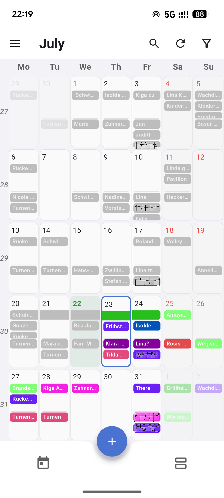 Monatsansicht | 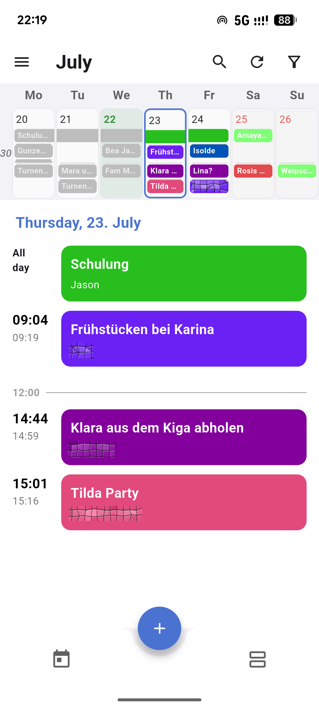 Tagesansicht |
| 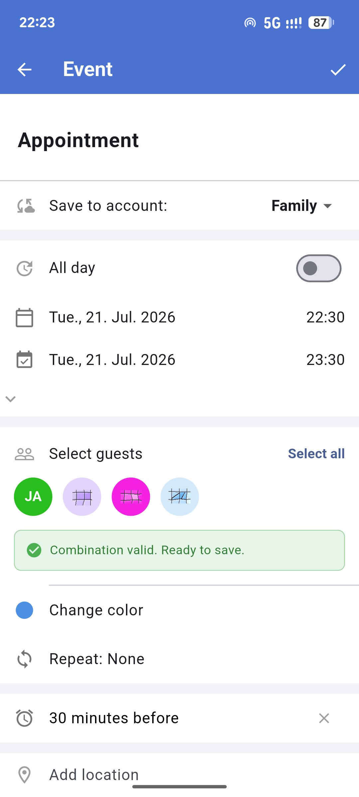 Termin anlegen, mit automatischer Kalender-Zuordnung | 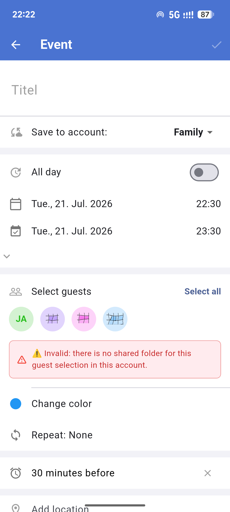 Gästeauswahl ohne passenden Kalender |

### Team & Workspaces

| | |
|---|---|
| 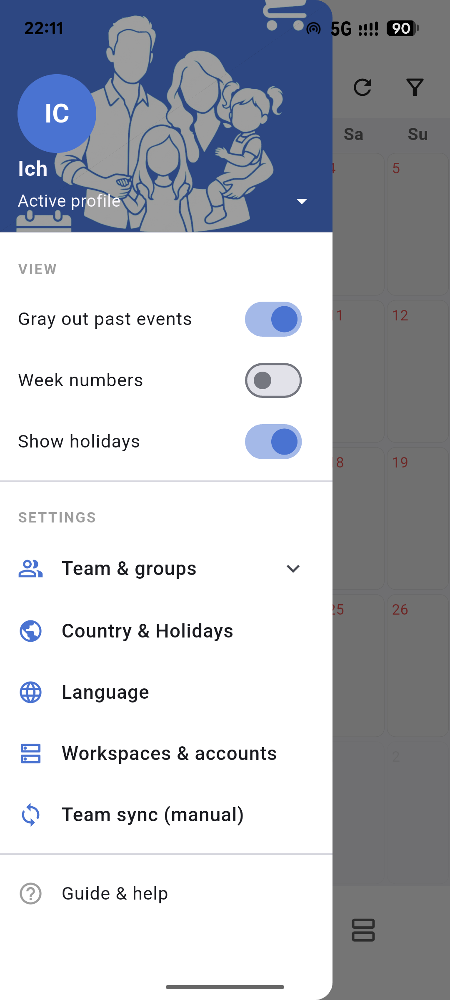 Hauptmenü | 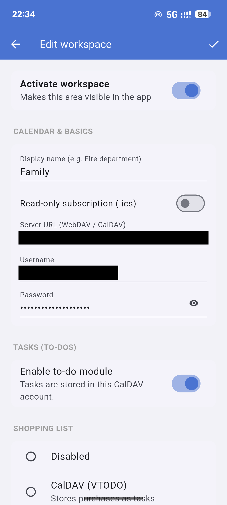 Workspace einrichten |
| 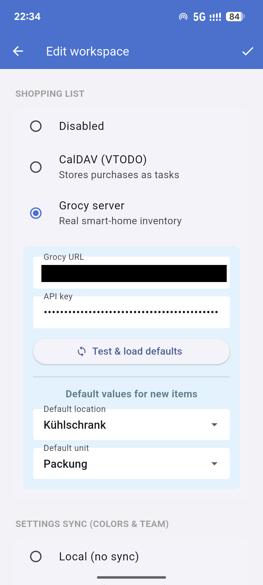 Grocy-Anbindung für einen Workspace | 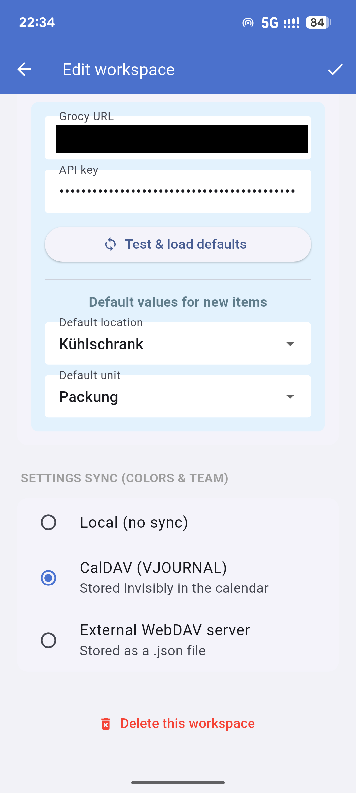 Einstellungs-Sync-Optionen für einen Workspace |
| 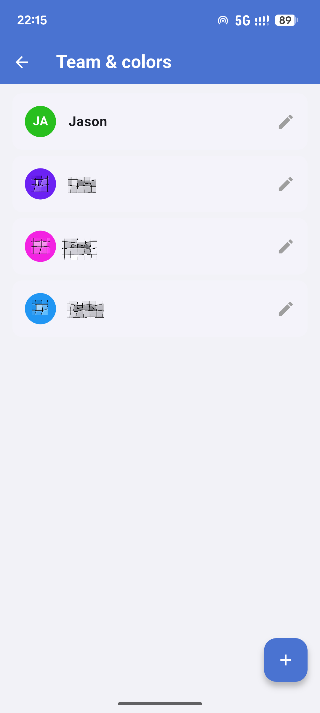 Teammitglieder | 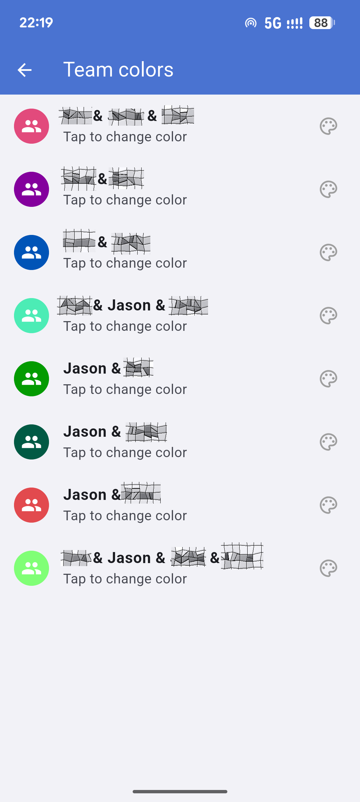 Team-Farben für gemeinsame Kalender |
| 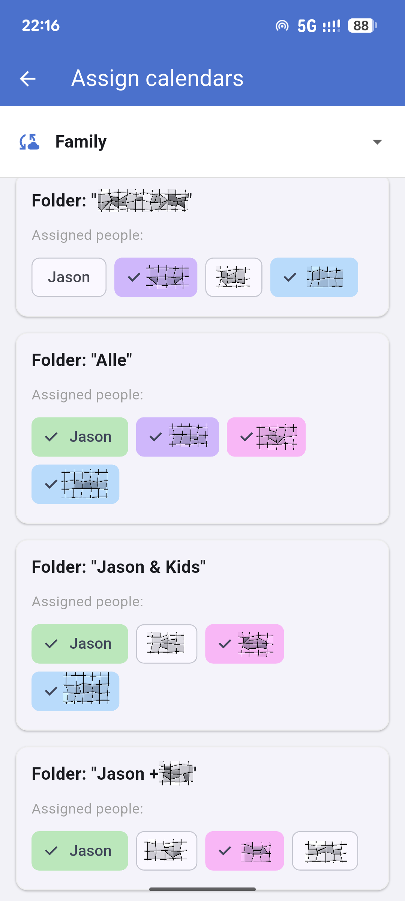 CalDAV-Ordner Personen zuordnen | |

### Einkaufsliste & Aufgaben

| | |
|---|---|
| 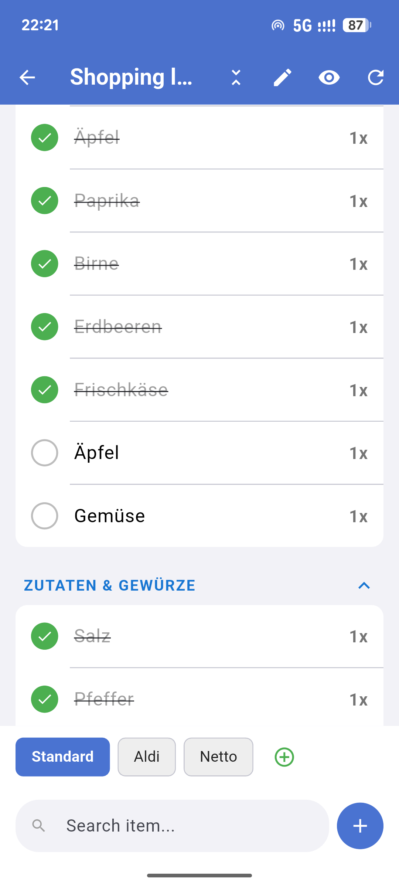 Einkaufsliste | 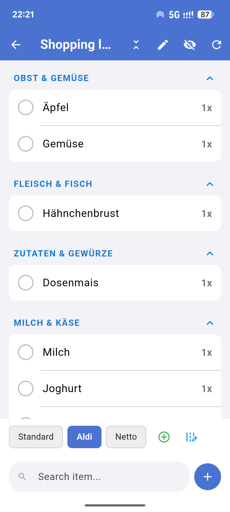 Einkaufsliste, sortiert für einen bestimmten Supermarkt |
| 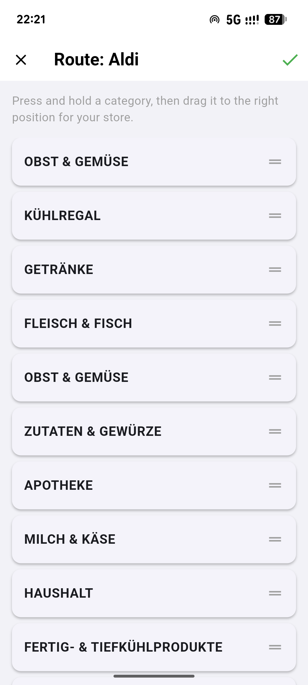 Supermarkt-Routen-Sortierung | 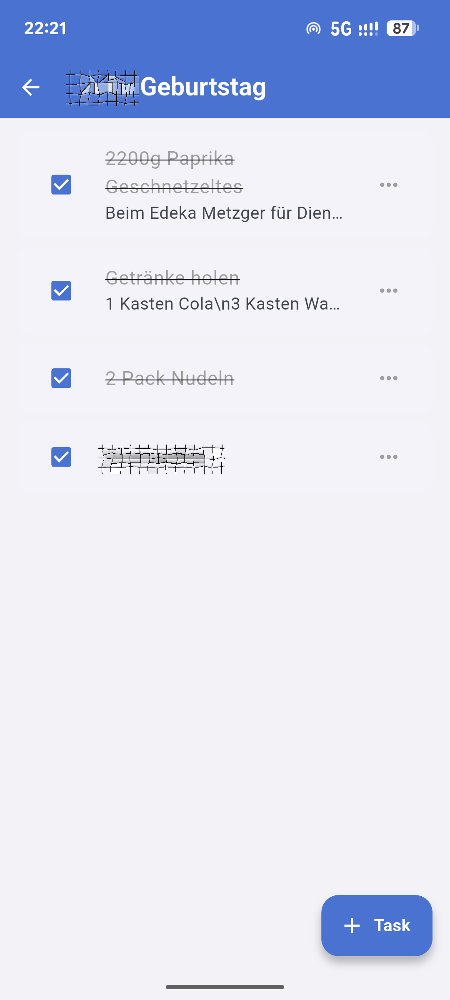 To-Do-Listen |
| 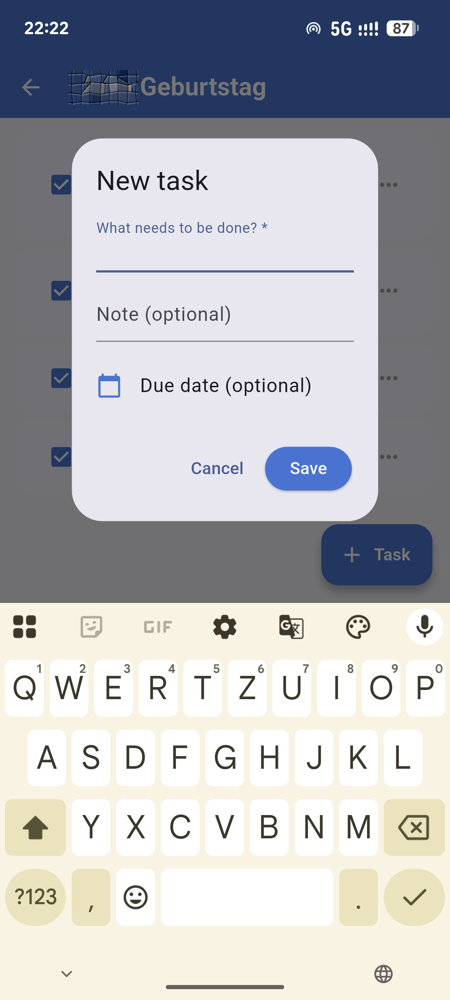 Aufgabe hinzufügen | |

---

## Funktionen

- **Mehrere Workspaces** – mehrere unabhängige CalDAV-Konten parallel nutzen (z. B. Familie, Verein, Arbeit), jeweils mit eigenem Team, eigener Einkaufsliste und eigenen Sync-Einstellungen
- **Funktioniert mit jedem Standard-CalDAV-Server** – Synology Calendar, Nextcloud oder jeder andere CalDAV-fähige Dienst; kein proprietäres Backend
- **Kalender pro Person, sauber getrennt** – jede Person bekommt einen echten eigenen Kalender und eine eigene Farbe, korrekt erkannt von anderen CalDAV-Clients und Integrationen (z. B. Home Assistant)
- **Automatische Kalender-Auswahl für gemeinsame Termine** – neben einem Kalender pro Person kannst du zusätzliche *Gruppen*-Kalender direkt in deinem CalDAV-Konto anlegen (z. B. einen Kalender für zwei bestimmte Personen). Fleuron erkennt diese Gruppenkalender und ordnet sie der Teilnehmer-Kombination zu, für die sie angelegt wurden. Beim Anlegen eines Termins wählst du einfach die teilnehmenden Personen aus – existiert ein passender Kalender für genau diese Kombination, wählt die App ihn automatisch aus, ganz ohne manuelle Kalenderauswahl
- **To-Dos** – CalDAV-basierte Aufgabenlisten (VTODO), geteilt oder privat
- **Einkaufsliste** – entweder CalDAV-basiert, oder angebunden an eine [Grocy](https://grocy.info)-Instanz für ein echtes Haushalts-Inventar
- **Supermarkt-Profile & Routen-Sortierung** – Einkaufslisten-Kategorien in der Reihenfolge anordnen, in der du durch einen bestimmten Markt läufst, pro Markt
- **Einstellungs-Sync zwischen Geräten** – Teammitglieder, Kalenderfarben und Supermarkt-Routen lassen sich zwischen Geräten per WebDAV oder huckepack über das CalDAV-Konto selbst synchronisieren, mit Geräte-Filtern, damit jedes Gerät selbst wählen kann, was übernommen wird
- **Feiertage** – automatisch im Kalender markiert, je nach Land/Region
- **Zweisprachig** – Deutsch und Englisch, in der App umschaltbar, ohne Neustart
- **Offline-fähig** – lokal zwischengespeichert; bei fehlender Verbindung werden die zuletzt bekannten Daten angezeigt statt eines leeren Bildschirms, und im Hintergrund wird leise synchronisiert, sobald wieder eine Verbindung besteht
- **Keine Cloud-Abhängigkeit** – deine Daten bleiben auf Servern, die du selbst kontrollierst

## Web-/PWA-Unterstützung

Die App läuft auch als Web-App / iOS-PWA. Da Browser direkte Cross-Origin-Anfragen an deinen Kalender-Server blockieren (CORS), braucht die Web-Version einen kleinen PHP-Tunnel (`cors.php`, in diesem Repo enthalten), der auf einem beliebigen PHP-fähigen Webspace liegt und die Anfragen sicher weiterleitet. Für die native Android-App ist das nicht nötig.

## Erste Schritte

Eine vollständige Einrichtungs- und Nutzungsanleitung ist direkt in die App eingebaut (Menü → Anleitung & Hilfe), inklusive:
- Ersten Workspace einrichten
- Die optionalen Grocy- und WebDAV-Sync-Module konfigurieren
- Den CORS-Tunnel für die Web-/PWA-Nutzung einrichten

## Tech-Stack

- [Flutter](https://flutter.dev) (Android und Web/PWA)
- CalDAV für Kalender- und Aufgaben-Sync
- Optionale [Grocy](https://grocy.info)-Anbindung für die Einkaufsliste
- Optionales WebDAV für geräteübergreifenden Einstellungs-Sync
- Lokales SQLite/SharedPreferences-Caching für Offline-Nutzung

## Mitwirken

Beiträge, Bug-Reports und Code-Reviews sind alle willkommen.

**Eine konkrete Sache, bei der ich wirklich Hilfe gebrauchen könnte:** die Veröffentlichung der App im **Apple App Store**. Ich hab aktuell keinen Apple-Developer-Account und würde mich sehr freuen, jemanden zu finden, der die iOS-Veröffentlichung übernimmt (oder mir den am wenigsten schmerzhaften Weg zeigt, es selbst zu tun). Falls du dabei helfen kannst, gerne ein Issue eröffnen oder melden.

## Lizenz

Dieses Projekt steht unter der [MIT-Lizenz](LICENSE) – nutzen, verändern, darauf aufbauen, auch kommerziell. Nur der Copyright-Hinweis muss erhalten bleiben.

## Haftungsausschluss

Dieses Projekt steht in keiner Verbindung zu und wird nicht unterstützt von Synology, Grocy, Nextcloud oder anderen Drittanbieter-Diensten, mit denen es sich verbindet. Alle Markennamen gehören ihren jeweiligen Eigentümern.
